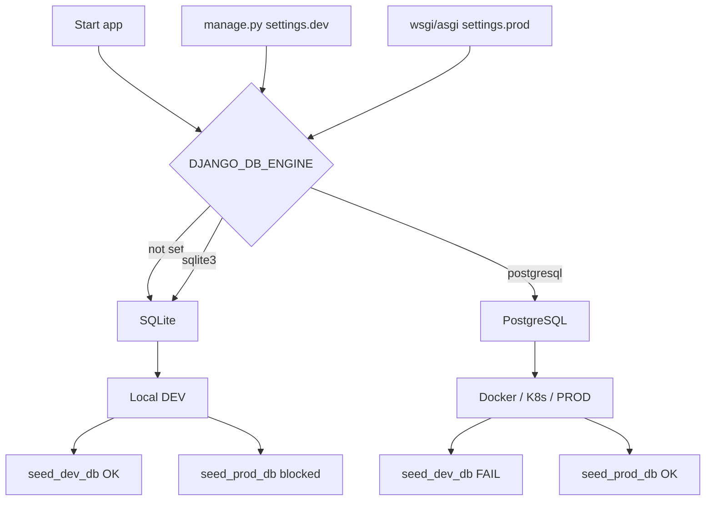

### Database Configuration Overview

This project uses different database configurations depending on the environment.

### Summary Table

| Environment        | Settings Module                     | Database        | Seeder Command        | Evidence / Source Files |
|-------------------|-----------------------------------|-----------------|-----------------------|------------------------|
| **DEV (default)** | `ai_powered_blog.settings.dev`    | SQLite          | `seed_dev_db`         | `manage.py`, `settings/base.py`, `settings/dev.py`, `seed_dev_db.py` |
| **PROD**          | `ai_powered_blog.settings.prod`   | PostgreSQL      | `seed_prod_db`        | `wsgi.py`, `asgi.py`, `terraform/apprunner.tf`, `terraform/rds.tf`, `seed_prod_db.py` |
| **Docker / Local Infra** | (env-driven)               | PostgreSQL      | (optional) `seed_prod_db` | `docker-compose.yml` |
| **Kubernetes**    | (env-driven)                      | PostgreSQL      | (optional) `seed_prod_db` | `k8s/django-configmap.yaml` |

### Mermaid diagram — DB resolution and seeder behavior

