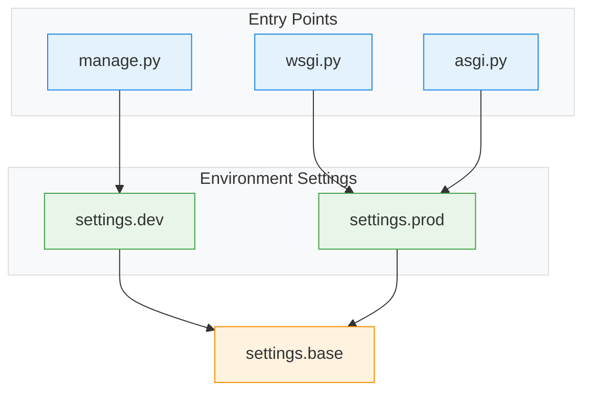

## ⚙️ Application Settings

### Settings Flow

- `settings.base.py` contains the shared default settings
- `settings.dev.py` imports everything from `base.py` and overrides only a few settings for local development
- `settings.prod.py` imports everything from `base.py` and overrides/adds production-specific settings

### Variables defined only in `settings.base`

| Variable | "Base" Value | Description |
|---|---|---|
| `BASE_DIR` | `Path(__file__).resolve().parents[2]` | Root directory of the project |
| `SECRET_KEY` | `get_env(...)` | Secret key used for cryptographic signing |
| `INSTALLED_APPS` | `[...]` | Installed Django apps |
| `AUTH_USER_MODEL` | `"users.User"` | Custom user model |
| `MIDDLEWARE` | `[...]` | Middleware stack |
| `ROOT_URLCONF` | `"ai_powered_blog.urls"` | URL routing config |
| `TEMPLATES` | `[...]` | Template engine config |
| `WSGI_APPLICATION` | `"ai_powered_blog.wsgi.application"` | WSGI entry |
| `ASGI_APPLICATION` | `"ai_powered_blog.asgi.application"` | ASGI entry |
| `DATABASE_ENGINE` | `get_env(...)` | Database engine |
| `DATABASES` | `dynamic config` | DB connection settings |
| `AUTH_PASSWORD_VALIDATORS` | `[...]` | Password validation rules |
| `LANGUAGE_CODE` | `"en-us"` | Default language |
| `TIME_ZONE` | `get_env(...)` | Timezone |
| `USE_I18N` | `True` | Internationalization |
| `USE_TZ` | `True` | Timezone-aware datetimes |
| `STATIC_URL` | `"/static/"` | Static URL prefix |
| `STATICFILES_DIRS` | `[BASE_DIR / "static"]` | Static dirs |
| `STATIC_ROOT` | `BASE_DIR / "staticfiles"` | Collected static dir |
| `STATICFILES_STORAGE` | `"whitenoise..."` | Static storage backend |
| `DEFAULT_AUTO_FIELD` | `"BigAutoField"` | Default PK type |
| `INTRO_OVERLAY_ENABLED` | `get_bool_env(...)` | UI intro toggle |
| `INTRO_OVERLAY_DURATION_MS` | `get_int_env(...)` | Intro duration |
| `INTRO_OVERLAY_IMAGE` | `get_env(...)` | Intro image |
| `SHOW_SIDEBAR_ON_HOME_STARTUP` | `get_bool_env(...)` | Sidebar toggle |
| `LIVE_POST_FILTER_ENABLED` | `get_bool_env(...)` | Live filter toggle |
| `SECURE_CONTENT_TYPE_NOSNIFF` | `True` | MIME sniff protection |
| `X_FRAME_OPTIONS` | `"DENY"` | Clickjacking protection |
| `SESSION_COOKIE_HTTPONLY` | `True` | HTTP-only session cookie |
| `SESSION_COOKIE_SAMESITE` | `get_env(...)` | SameSite session policy |
| `CSRF_COOKIE_HTTPONLY` | `get_bool_env(...)` | HTTP-only CSRF cookie |
| `CSRF_COOKIE_SAMESITE` | `get_env(...)` | SameSite CSRF policy |
| `SECURE_REFERRER_POLICY` | `get_env(...)` | Referrer policy |
| `SECURE_CROSS_ORIGIN_OPENER_POLICY` | `get_env(...)` | COOP policy |
| `APP_CSP_ENABLED` | `get_bool_env(...)` | Enable CSP |
| `APP_CSP_DIRECTIVES` | `{...}` | CSP rules |
| `APP_CSP_EXCLUDE_PATH_PREFIXES` | `("/admin/",)` | CSP exclusions |
| `APP_PERMISSIONS_POLICY_ENABLED` | `get_bool_env(...)` | Enable permissions policy |
| `APP_PERMISSIONS_POLICY` | `{...}` | Browser feature restrictions |

### Variables overridden in `settings.dev` or `settings.prod`

| Variable | Base | Dev | Prod | Description |
|---|---|---|---|---|
| `DEBUG` | `get_bool_env(..., False)` | `True` | `False` | Enables debug mode |
| `ALLOWED_HOSTS` | `get_list_env(..., ["127.0.0.1","localhost"])` | `["127.0.0.1","localhost"]` | `get_list_env(..., [])` | Allowed hosts/domains |
| `EMAIL_BACKEND` | `-` | `"console backend"` | `-` | Email backend |
| `SESSION_COOKIE_SECURE` | `-` | `-` | `get_bool_env(...)` | HTTPS-only cookie |
| `CSRF_COOKIE_SECURE` | `-` | `-` | `get_bool_env(...)` | Secure CSRF cookie |
| `CSRF_TRUSTED_ORIGINS` | `-` | `-` | `get_list_env(...)` | Trusted CSRF origins |
| `SECURE_SSL_REDIRECT` | `-` | `-` | `get_bool_env(...)` | Force HTTPS |
| `SECURE_HSTS_SECONDS` | `-` | `-` | `get_int_env(...)` | HSTS duration |
| `SECURE_HSTS_INCLUDE_SUBDOMAINS` | `-` | `-` | `get_bool_env(...)` | HSTS subdomains |
| `SECURE_HSTS_PRELOAD` | `-` | `-` | `get_bool_env(...)` | HSTS preload |
| `SECURE_PROXY_SSL_HEADER` | `-` | `-` | `("HTTP_X_FORWARDED_PROTO","https")` | Proxy SSL header |
| `USE_X_FORWARDED_HOST` | `-` | `-` | `True` | Use proxy host |
