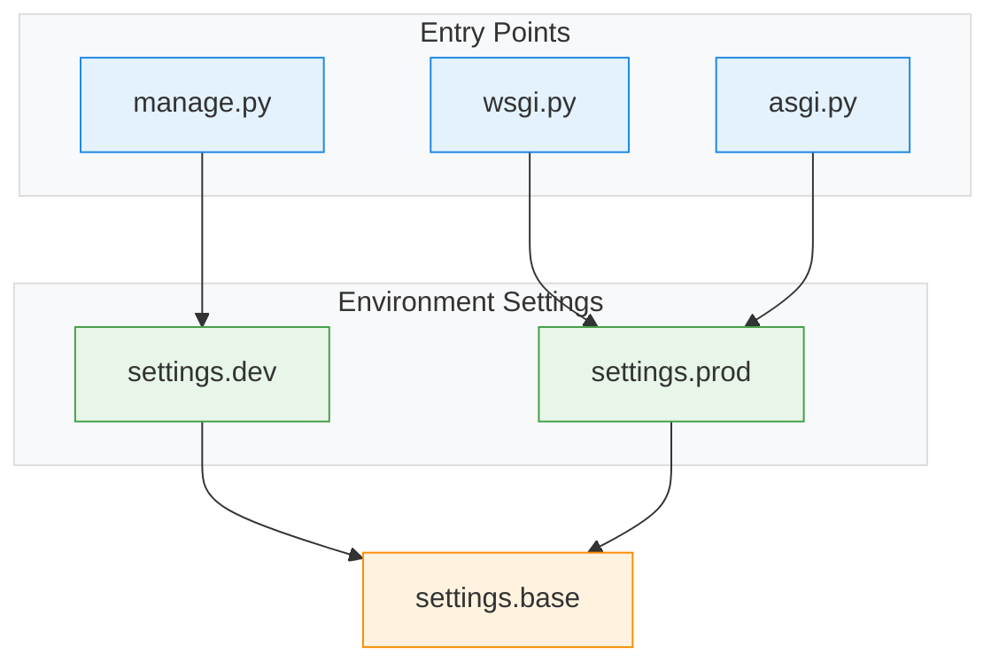

## ⚙️ Application Settings Flow

```mermaid
graph TD
    subgraph EP[Entry Points]
        A[manage.py]
        C[wsgi.py]
        E[asgi.py]
    end

    subgraph ES[Environment Settings]
        B[settings.dev]
        D[settings.prod]
    end

    F[settings.base]

    A --> B
    C --> D
    E --> D
    B --> F
    D --> F

    %% Node styles
    classDef entry fill:#e3f2fd,stroke:#1e88e5;
    classDef config fill:#e8f5e9,stroke:#43a047;
    classDef base fill:#fff3e0,stroke:#fb8c00;

    class A,C,E entry;
    class B,D config;
    class F base;

    %% ✅ THIS NOW WORKS
    style EP fill:#f8f9fa,stroke:#ddd
    style ES fill:#f8f9fa,stroke:#ddd
```

