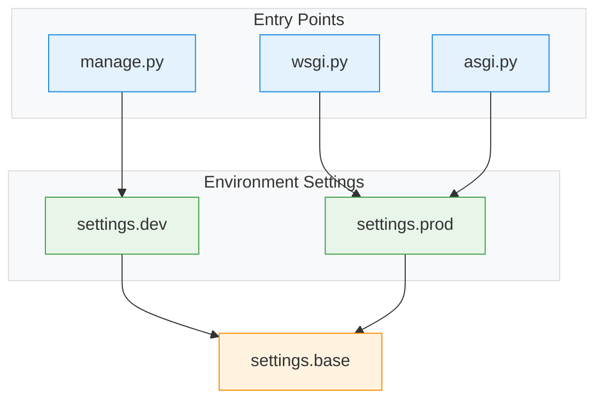

## ⚙️ Application Settings

### Settings Flow

- `settings.base.py` contains the shared default settings
- `settings.dev.py` imports everything from `base.py` and overrides only a few settings for local development
- `settings.prod.py` imports everything from `base.py` and overrides/adds production-specific settings

### Settings Values

| Variable | Values (base / dev / prod) | Description |
|---|---|---|
| `BASE_DIR` | **base:** `Path(__file__).resolve().parents[2]` **dev:** `-` **prod:** `-` | Root directory of the project |
| `SECRET_KEY` | **base:** `get_env(...)` **dev:** `-` **prod:** `-` | Secret key used for cryptographic signing |
| `DEBUG` | **base:** `get_bool_env(..., False)` **dev:** `True` **prod:** `False` | Enables debug mode |
| `ALLOWED_HOSTS` | **base:** `get_list_env(..., ["127.0.0.1","localhost"])` **dev:** `["127.0.0.1","localhost"]` **prod:** `get_list_env(..., [])` | Allowed hosts/domains |
| `INSTALLED_APPS` | **base:** `[...]` **dev:** `-` **prod:** `-` | Installed Django apps |
| `AUTH_USER_MODEL` | **base:** `"users.User"` **dev:** `-` **prod:** `-` | Custom user model |
| `MIDDLEWARE` | **base:** `[...]` **dev:** `-` **prod:** `-` | Middleware stack |
| `ROOT_URLCONF` | **base:** `"ai_powered_blog.urls"` **dev:** `-` **prod:** `-` | URL routing config |
| `TEMPLATES` | **base:** `[...]` **dev:** `-` **prod:** `-` | Template engine config |
| `WSGI_APPLICATION` | **base:** `"ai_powered_blog.wsgi.application"` **dev:** `-` **prod:** `-` | WSGI entry |
| `ASGI_APPLICATION` | **base:** `"ai_powered_blog.asgi.application"` **dev:** `-` **prod:** `-` | ASGI entry |
| `DATABASE_ENGINE` | **base:** `get_env(...)` **dev:** `-` **prod:** `-` | Database engine |
| `DATABASES` | **base:** `dynamic config` **dev:** `-` **prod:** `-` | DB connection settings |
| `AUTH_PASSWORD_VALIDATORS` | **base:** `[...]` **dev:** `-` **prod:** `-` | Password validation rules |
| `LANGUAGE_CODE` | **base:** `"en-us"` **dev:** `-` **prod:** `-` | Default language |
| `TIME_ZONE` | **base:** `get_env(...)` **dev:** `-` **prod:** `-` | Timezone |
| `USE_I18N` | **base:** `True` **dev:** `-` **prod:** `-` | Internationalization |
| `USE_TZ` | **base:** `True` **dev:** `-` **prod:** `-` | Timezone-aware datetimes |
| `STATIC_URL` | **base:** `"/static/"` **dev:** `-` **prod:** `-` | Static URL prefix |
| `STATICFILES_DIRS` | **base:** `[BASE_DIR / "static"]` **dev:** `-` **prod:** `-` | Static dirs |
| `STATIC_ROOT` | **base:** `BASE_DIR / "staticfiles"` **dev:** `-` **prod:** `-` | Collected static dir |
| `STATICFILES_STORAGE` | **base:** `"whitenoise..."` **dev:** `-` **prod:** `-` | Static storage backend |
| `DEFAULT_AUTO_FIELD` | **base:** `"BigAutoField"` **dev:** `-` **prod:** `-` | Default PK type |
| `EMAIL_BACKEND` | **base:** `-` **dev:** `"console backend"` **prod:** `-` | Email backend |
| `INTRO_OVERLAY_ENABLED` | **base:** `get_bool_env(...)` **dev:** `-` **prod:** `-` | UI intro toggle |
| `INTRO_OVERLAY_DURATION_MS` | **base:** `get_int_env(...)` **dev:** `-` **prod:** `-` | Intro duration |
| `INTRO_OVERLAY_IMAGE` | **base:** `get_env(...)` **dev:** `-` **prod:** `-` | Intro image |
| `SHOW_SIDEBAR_ON_HOME_STARTUP` | **base:** `get_bool_env(...)` **dev:** `-` **prod:** `-` | Sidebar toggle |
| `LIVE_POST_FILTER_ENABLED` | **base:** `get_bool_env(...)` **dev:** `-` **prod:** `-` | Live filter toggle |
| `SECURE_CONTENT_TYPE_NOSNIFF` | **base:** `True` **dev:** `-` **prod:** `-` | MIME sniff protection |
| `X_FRAME_OPTIONS` | **base:** `"DENY"` **dev:** `-` **prod:** `-` | Clickjacking protection |
| `SESSION_COOKIE_HTTPONLY` | **base:** `True` **dev:** `-` **prod:** `-` | HTTP-only session cookie |
| `SESSION_COOKIE_SAMESITE` | **base:** `get_env(...)` **dev:** `-` **prod:** `-` | SameSite session policy |
| `SESSION_COOKIE_SECURE` | **base:** `-` **dev:** `-` **prod:** `get_bool_env(...)` | HTTPS-only cookie |
| `CSRF_COOKIE_HTTPONLY` | **base:** `get_bool_env(...)` **dev:** `-` **prod:** `-` | HTTP-only CSRF cookie |
| `CSRF_COOKIE_SAMESITE` | **base:** `get_env(...)` **dev:** `-` **prod:** `-` | SameSite CSRF policy |
| `CSRF_COOKIE_SECURE` | **base:** `-` **dev:** `-` **prod:** `get_bool_env(...)` | Secure CSRF cookie |
| `CSRF_TRUSTED_ORIGINS` | **base:** `-` **dev:** `-` **prod:** `get_list_env(...)` | Trusted CSRF origins |
| `SECURE_REFERRER_POLICY` | **base:** `get_env(...)` **dev:** `-` **prod:** `-` | Referrer policy |
| `SECURE_CROSS_ORIGIN_OPENER_POLICY` | **base:** `get_env(...)` **dev:** `-` **prod:** `-` | COOP policy |
| `SECURE_SSL_REDIRECT` | **base:** `-` **dev:** `-` **prod:** `get_bool_env(...)` | Force HTTPS |
| `SECURE_HSTS_SECONDS` | **base:** `-` **dev:** `-` **prod:** `get_int_env(...)` | HSTS duration |
| `SECURE_HSTS_INCLUDE_SUBDOMAINS` | **base:** `-` **dev:** `-` **prod:** `get_bool_env(...)` | HSTS subdomains |
| `SECURE_HSTS_PRELOAD` | **base:** `-` **dev:** `-` **prod:** `get_bool_env(...)` | HSTS preload |
| `SECURE_PROXY_SSL_HEADER` | **base:** `-` **dev:** `-` **prod:** `("HTTP_X_FORWARDED_PROTO","https")` | Proxy SSL header |
| `USE_X_FORWARDED_HOST` | **base:** `-` **dev:** `-` **prod:** `True` | Use proxy host |
| `APP_CSP_ENABLED` | **base:** `get_bool_env(...)` **dev:** `-` **prod:** `-` | Enable CSP |
| `APP_CSP_DIRECTIVES` | **base:** `{...}` **dev:** `-` **prod:** `extended {...}` | CSP rules |
| `APP_CSP_EXCLUDE_PATH_PREFIXES` | **base:** `("/admin/",)` **dev:** `-` **prod:** `-` | CSP exclusions |
| `APP_PERMISSIONS_POLICY_ENABLED` | **base:** `get_bool_env(...)` **dev:** `-` **prod:** `-` | Enable permissions policy |
| `APP_PERMISSIONS_POLICY` | **base:** `{...}` **dev:** `-` **prod:** `-` | Browser feature restrictions |
