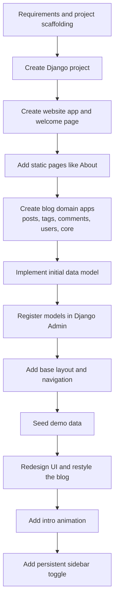

# AIPoweredPythonBlog Roadmap

## High-level implementation order

```mermaid
flowchart TD
    A[Requirements and project scaffolding] --> B[Create Django project]
    B --> C[Create website app and welcome page]
    C --> D[Add static pages like About]
    D --> E[Create blog domain apps<br/>posts, tags, comments, users, core]
    E --> F[Implement initial data model]
    F --> G[Register models in Django Admin]
    G --> H[Add base layout and navigation]
    H --> I[Seed demo data]
    I --> J[Redesign UI and restyle the blog]
    J --> K[Add intro animation]
    K --> L[Add persistent sidebar toggle]
```
